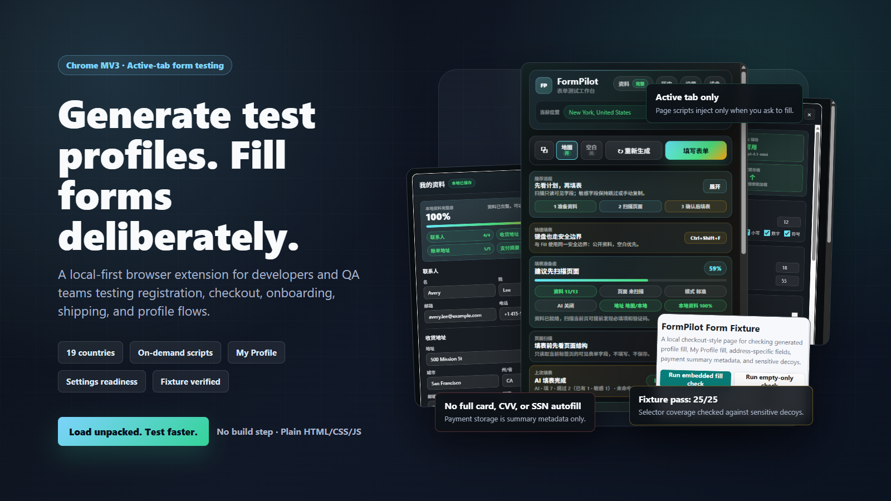
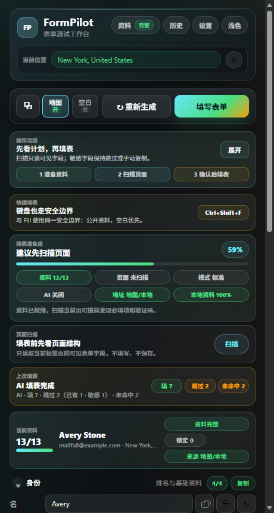
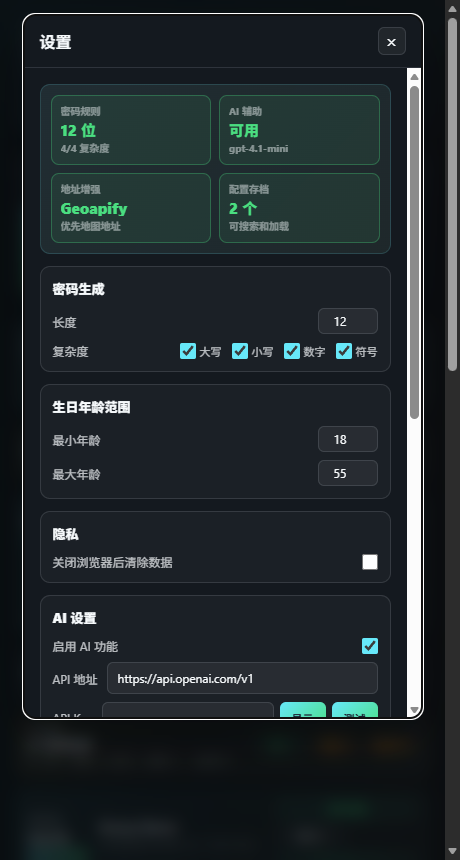
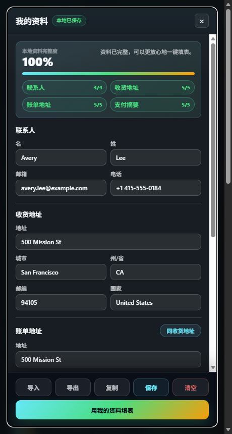
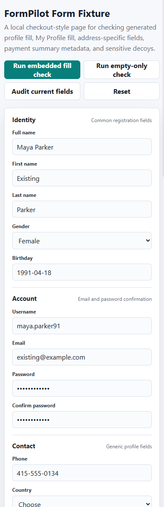
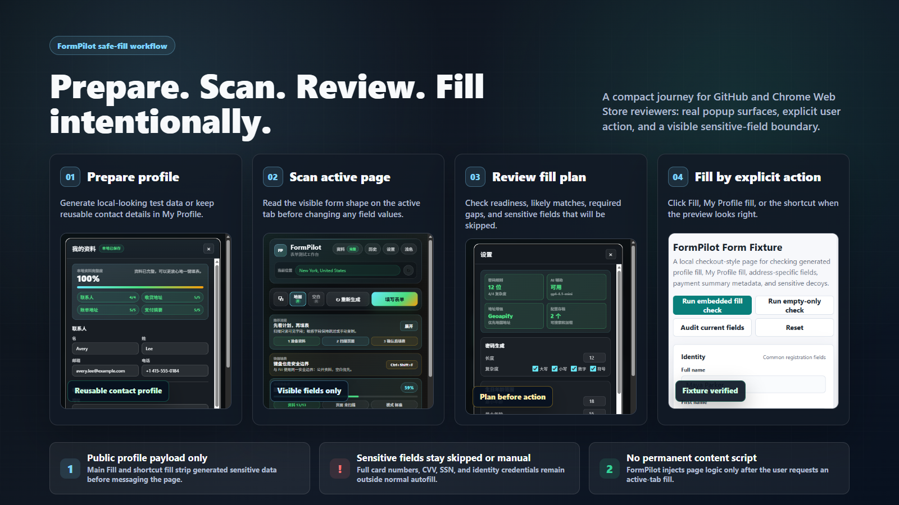

# FormPilot


FormPilot 是一个 Chrome Manifest V3 浏览器扩展，用来生成真实感测试资料、保存可复用联系人资料，并且只在用户明确触发后填充当前网页表单。

它面向开发者、QA、产品和增长团队，适合反复测试注册、结账、资料页、配送地址、账单地址和表单 onboarding 流程。项目保持可检查、可维护：纯 HTML/CSS/JS、no build step、无框架锁定，也没有永久 `content_scripts` 或永久 `<all_urls>` 内容脚本。

> English README 已整理到 [docs/README.en.md](docs/README.en.md)。



## 快速开始

本地安装扩展：

1. 在 Chrome 打开 `chrome://extensions`，或在 Edge 打开 `edge://extensions`。
2. 打开 Developer mode / 开发者模式。
3. 点击 Load unpacked / 加载已解压的扩展程序。
4. 选择这个仓库根目录。

日常自检：

```powershell
node scripts/verify-release.cjs
```

打包 Chrome Web Store 可上传 zip：

```powershell
node scripts/package-extension.cjs
node scripts/verify-package.cjs
```

生成结果位于 `dist/formpilot-1.8.0.zip`。

## 项目概览

| 项目 | 当前状态 |
| --- | --- |
| 运行形态 | Chrome Manifest V3 extension，使用 plain HTML, CSS, and JavaScript。 |
| 安装方式 | 从仓库根目录加载已解压扩展；无需构建，也不依赖 package manager。 |
| 数据覆盖 | 生成 19 个国家和地区的资料，并支持通过 `meiguodizhi.com` 生成美国州/城市地址。 |
| 填表模型 | 用户触发的 active-tab fill，使用 on-demand script injection。 |
| 安全边界 | 不自动填完整卡号、CVV、SSN 或生成的敏感字段；不使用永久 `<all_urls>` 或永久 `content_scripts`。 |
| 验证体系 | 发布门禁、fixture contract、popup keyboard QA、unpacked-extension smoke test、runtime-only package builder 和 zip boundary inspection。 |

## 为什么做 FormPilot

表单测试常见的重复工作是：编一个可信用户、选择本地化地址、维护一份真实联系人资料、复制验证码、填入页面，然后确认支付或身份类敏感字段没有被误填。FormPilot 把这些工作集中在一个 popup 里。

FormPilot 重点守住四个产品承诺：

- 快速生成 19 个国家和地区的测试资料，包括本地化姓名、电话、地址、城市/州和邮编。
- 通过 active-tab、on-demand script injection 控制填表，不注册永久 `<all_urls>` 内容脚本。
- 保持清晰安全边界：My Profile 只保存联系人、地址和 payment summary metadata；完整卡号、CVV、SSN、generated sensitive display fields 不进入普通自动填表 payload。
- 可选 AI field mapping 也遵守相同边界，不自动填身份、金融、雇佣或支付凭证字段。

## 产品截图

| 主工作区 | Settings | My Profile | Fixture check |
| --- | --- | --- | --- |
|  |  |  |  |

## 工作流演示



Prepare. Scan. Review. Fill intentionally. 这个 workflow demo 展示了安全路径：先准备公开资料，再扫描当前页面的可见字段，审核填表计划，最后由用户显式触发 Fill；敏感字段保持跳过或手动处理。

## 核心功能

- 按检测到的 IP 国家或手动选择国家生成测试资料。
- 在 popup 内查看已支持的 generated countries，再选择国家。
- 通过 `meiguodizhi.com` 按美国州或城市生成资料。
- 填充注册、账号、联系、配送、账单和个人资料表单。
- 填表前扫描 active tab，预览 visible fields、likely standard-field matches、required-field coverage、sensitive required fields、page type、CAPTCHA presence，以及 compact scan-based fill plan。
- 使用安全填表流程提示：准备资料、扫描页面、审核计划、再显式 Fill。
- 查看 shortcut confidence / 快捷键提示，确认当前快捷键和 Fill 使用相同公开资料边界。
- 查看 fill-readiness / 填表准备度，综合 generated profile completeness、active-page match preview、fill mode、AI readiness、address mode、My Profile completeness。
- 保留 last-fill / 上次填表结果，显示 matched、skipped、missed、skip-reason 统计。
- 支持 empty-fields-only mode，只填空字段，避免覆盖页面已有值。
- 保存 My Profile：姓名、邮箱、电话、shipping address、billing address、payment summary metadata。
- My Profile 本地自动保存，并显示保存状态。
- My Profile completeness feedback and missing-field focus：一眼看到缺失项，并跳到第一个缺失字段。
- 主工作区显示 generated-profile completeness、missing fields、lock count、source。
- generated profile 支持 identity、account、contact 等 section completion badges。
- generated-profile section collapse preferences 可在 popup reopen / refresh 后保持。
- My Profile 支持 shipping address 同步到 billing address。
- My Profile、History 删除使用二次确认，减少误删。
- 导入/导出非敏感 My Profile JSON。
- 设置页支持 OpenAI-compatible API key show/hide control。
- AI mode 只有在 AI 启用并保存 API key 后才可用，关闭 AI 设置后会清理 command toggle。
- Settings overview and API key show/hide control：设置页展示密码规则、AI、地址增强、archives 等 readiness。
- Mail.tm temporary inboxes，支持复制验证码，并展示外部服务恢复 / service recovery 状态。
- 支持锁定 generated fields 后再重新生成。
- 支持复制单个字段、identity/account/contact blocks、postal mailing-address lines、完整公开 profile，搜索 archives 和 recent fill history。
- Copy All、Regenerate、Fill 固定在 sticky command dock，长资料浏览时仍可触达。
- 可选 OpenStreetMap Nominatim 或 Geoapify 地址增强，失败时展示 local fallback。
- 可选 OpenAI-compatible API，用于 unusual form fields 的智能映射。

## 支持的生成国家和地区

FormPilot 当前支持 United States、United Kingdom、Canada、Australia、China、Japan、South Korea、Germany、France、Russia、Spain、Italy、Brazil、India、Singapore、Taiwan、Hong Kong、Mexico、Netherlands。

每个支持项都包含本地姓名、电话格式、城市或州数据、街道数据和邮编生成。通过 `meiguodizhi.com` 的定点位置搜索目前仅支持美国州和城市。

## 权限模型

FormPilot 使用固定 host access 访问已知服务：IP lookup、Mail.tm、`meiguodizhi.com`、Geoapify、OpenStreetMap Nominatim 和默认 OpenAI API endpoint。

扩展不注册永久 `<all_urls>` content script。只有在点击 Fill、使用 My Profile fill 或触发键盘快捷键时，才会注入页面脚本。自定义 OpenAI-compatible endpoint 会在运行时请求 optional host permissions。

## 安全边界

FormPilot 可能展示第三方资料服务返回的敏感测试资料，但这些字段只允许手动复制，不进入普通自动填表 payload，也不会进入 Copy All。

生成资料里的敏感展示字段也会排除在 generated-profile cache、archives 和 recent fill history 之外。缓存、归档和历史记录只保留公开资料字段。

My Profile 只保存联系人和地址数据，以及 payment summary metadata。支付摘要只包含 issuer、network、last four、expiry、billing note，不保存完整卡号、CVV 或 SSN。

My Profile import/export 使用同一份白名单。导入本地 JSON 时会先清洗，未知字段和禁止的敏感字段会被丢弃，不会写入页面。

键盘快捷键自动填表和主 Fill action 只使用 public profile fields。Empty-fields-only mode 会让 content script 跳过已经有值的可见字段。可选 AI field mapping 只有在 AI 开启并保存 API key 后才启用，并会在发送 smart-fill payload 前移除完整卡号、CVV/CVC、SSN、税号、national IDs、护照号码、driver's license numbers、银行账号、收入、薪资、雇主、公司名和雇佣状态。

Generated-profile section collapse preferences、section completion badges、workflow guidance state、shortcut confidence state、active-page match preview、scan-based fill plan preview、sensitive skip preview、external service recovery states、fill-readiness surface 和 last-fill result surface 都是 UI-only state。它们不会进入 profile generation、My Profile、import/export、Copy All、page scan storage、keyboard shortcut payload 或任何 fill payload。

## 文件夹整理说明

运行时文件保持在仓库根目录、`popup/`、`scripts/` 和 `icons/`，因为浏览器扩展加载和打包脚本依赖这些路径。文档、营销素材、测试夹具和本地输出则分区放置，避免混在运行时代码里。

| 路径 | 用途 |
| --- | --- |
| `manifest.json` | MV3 metadata、permissions、popup、background worker、commands、optional host permissions。 |
| `background.js` | context menu、keyboard shortcut、startup cleanup、on-demand content script injection。 |
| `popup/` | 扩展 popup UI 和功能模块。 |
| `scripts/content.js` | 注入页面后的 form scanning and filling。 |
| `scripts/generators.js` | 国家数据、资料生成、位置服务和外部地址 adapter。 |
| `scripts/selectors/` | 通用和 Japan-specific field selector maps。 |
| `icons/` | 扩展图标。 |
| `assets/marketing/` | README hero、workflow demo、store promo 等可复现营销素材源文件和 PNG。 |
| `docs/` | 架构、路线图、发布审计、商店文案、英文 README 归档。 |
| `tests/manual/` | 本地表单 fixture，用于 selector coverage 和 sensitive decoy protection。 |
| `output/playwright/` | 本地浏览器 QA 截图输出。 |
| `dist/` | 打包输出目录，包含 `dist/formpilot-1.8.0.zip`。 |
| `.github/` | GitHub Actions、issue templates、pull request template。 |

## 常用脚本

发布前运行主检查：

```powershell
node scripts/verify-release.cjs
```

这个脚本会检查 JavaScript 语法、解析 `manifest.json`、验证 MV3 权限边界，确认 My Profile 不会自动填或导入/导出完整卡号、CVV、SSN、generated sensitive fields，并检查国家生成覆盖、fixture contract、popup modal accessibility contracts 和本地文档资产。

修改 selectors、content fill behavior、My Profile payloads 或 manual fixture 后运行：

```powershell
node scripts/verify-fixture.cjs
```

需要真实浏览器的 fixture QA：

```powershell
node scripts/verify-fixture-browser.cjs
```

修改 modal、focus 或 popup layout 后运行 popup keyboard QA：

```powershell
node scripts/verify-popup-keyboard.cjs
```

刷新 README、workflow demo 和 store marketing assets：

```powershell
node scripts/render-hero.cjs
```

Marketing renderer 会打开 `assets/marketing/formpilot-hero.html`、`assets/marketing/formpilot-workflow-demo.html`、`assets/marketing/formpilot-store-promo.html`，等待当前 main、Settings、My Profile 和 fixture screenshots 加载，验证固定导出尺寸无 overflow，然后写出 `assets/marketing/formpilot-hero.png`、`assets/marketing/formpilot-workflow-demo.png`、`assets/marketing/formpilot-store-promo.png`。

发布前可选运行 unpacked-extension smoke test：

```powershell
node scripts/verify-extension-runtime.cjs
```

如本机 Chrome 或 Edge 路径特殊，可设置 `CHROME_PATH`。如果稳定版 Chrome 拒绝自动化 unpacked-extension flags，可指向 Microsoft Edge、Chromium 或 Chrome for Testing。

创建 Chrome Web Store ready zip：

```powershell
node scripts/package-extension.cjs
node scripts/verify-package.cjs
```

package verifier 会确认 zip 只包含 runtime extension files，并排除本地工作流元数据、screenshots、fixtures、marketing sources、docs 和本地工具状态。

## GitHub / 发布流程

`.github/workflows/release-check.yml` 会在 Ubuntu 上运行 static release gate、fixture contract check、package build 和 zip boundary inspection，以覆盖大小写敏感路径问题；随后在 Windows real-browser popup and fixture QA 上运行浏览器 fixture、popup keyboard QA 和 marketing asset renderer，并上传打包后的扩展 zip。

发布前建议检查：

- 确认扩展可以从仓库根目录加载为 unpacked extension，没有 manifest errors。
- 运行 `node scripts/verify-release.cjs`。
- 修改 selector、fixture、My Profile 或 fill behavior 后运行 `node scripts/verify-fixture.cjs`。
- 修改 selector、content-script fill、smart-fill 或 empty-fields-only 行为后运行 `node scripts/verify-fixture-browser.cjs`。
- 修改 modal、focus 或 popup layout 后运行 `node scripts/verify-popup-keyboard.cjs`。
- 修改截图、README hero、workflow demo 或 store promo 后运行 `node scripts/render-hero.cjs`。
- 本地有 Chrome 或 Edge 时，发布前运行 `node scripts/verify-extension-runtime.cjs`。
- 运行 `node scripts/package-extension.cjs` 并检查 zip 内容。
- 打包后运行 `node scripts/verify-package.cjs`。
- 打 tag 前检查 [CHANGELOG.md](CHANGELOG.md) 和 [docs/release-audit.md](docs/release-audit.md)。
- 权限、存储、AI 或外部服务变更时检查 [PRIVACY.md](PRIVACY.md)。

## 相关文档

- [docs/architecture.md](docs/architecture.md)：架构和数据边界说明。
- [docs/roadmap.md](docs/roadmap.md)：路线图、近期重点、后续方向和明确非目标。
- [docs/release-audit.md](docs/release-audit.md)：维护者发布检查清单。
- [docs/store-listing.md](docs/store-listing.md)：Chrome Web Store 文案草稿和权限说明。
- [docs/README.en.md](docs/README.en.md)：英文 README 归档。
- [CHANGELOG.md](CHANGELOG.md)：版本变更记录。
- [CONTRIBUTING.md](CONTRIBUTING.md)：贡献指南。
- [SECURITY.md](SECURITY.md)：安全报告方式和项目安全边界。

## 贡献

改动请保持小而可验证，并始终检查 generated display data 和 auto-fill payload 之间的边界。Selector 改进最好配套本地 fixture、真实表单模式或聚焦的回归案例。

提交 PR 时请保持 no-build architecture、narrow permission model 和 sensitive-field boundary 不变。

## 安全

如发现敏感安全问题，优先私下报告。详见 [SECURITY.md](SECURITY.md)。

## License

MIT. See [LICENSE](LICENSE)。
