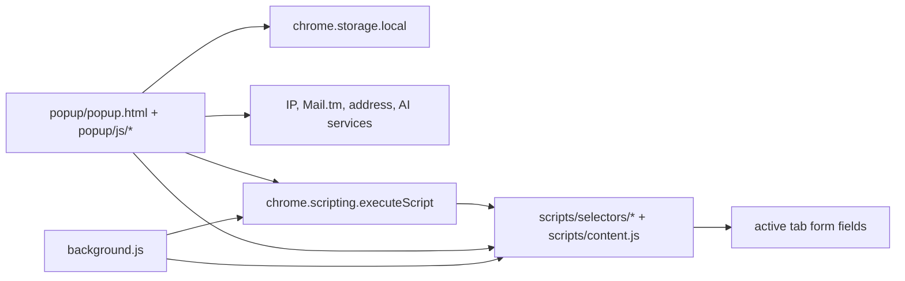

# FormPilot Architecture

FormPilot is a no-build Chrome Manifest V3 extension. Runtime code is plain HTML, CSS, and JavaScript so contributors can inspect the package that Chrome loads.

## Runtime Shape

The popup owns profile generation, settings, history, archives, temporary inboxes, My Profile, optional AI mapping, first-run workflow guidance, shortcut confidence hint, active-page scan preview, scan-based fill plan preview, external service recovery states, fill readiness, and explicit fill actions. The main popup keeps Copy All, Regenerate, and Fill in a sticky command dock so the primary workflow stays reachable while scanning longer profiles. The workflow guidance summarizes the safe sequence: prepare generated data, scan the active page, review the plan, then fill by explicit action. The shortcut confidence hint reads the browser's `fill-form` command binding when available and reminds users that shortcut fill follows the same public-profile and empty-fields-only boundary as Fill. The scan preview reuses the existing content-script `scanForm` action to summarize visible fields, likely standard-field matches, required-field coverage, sensitive required fields that will be skipped, page type, and CAPTCHA presence without filling or storing page data. It renders match, required, and sensitive-skip signals as compact scan-summary chips and a small plan of public fields likely to fill, required labels still needing review, and sensitive labels that will be skipped so the pre-fill decision is easier to scan at popup width. The fill-readiness surface combines generated profile completeness, scan match preview, fill mode, AI readiness, address mode, and My Profile completeness into a derived UI-only status before Fill. The background worker owns the context menu, keyboard shortcut, startup cleanup, and a second on-demand injection path for shortcut fills.

## Script Loading

`popup/popup.html` loads shared generators first, then popup modules in dependency order. The project does not use modules or a bundler, so global state lives in `popup/js/constants.js` and DOM references are filled by `popup/popup.js` on `DOMContentLoaded`.

Page-side scripts are not registered as permanent content scripts. `sendMessageToTab()` in `popup/js/utils.js` injects `scripts/selectors/common.js`, `scripts/selectors/japan.js`, and `scripts/content.js` only when a fill or scan action needs the active tab.

## Data Boundaries

Generated profile data lives in `currentData`. Location context lives in `ipData`. Settings, archives, history, locked fields, and My Profile are stored through `chrome.storage.local`.

`currentData.sensitive` may contain externally generated display-only fields from third-party profile services. Standard fill payloads must go through `getPublicProfileData()` so those sensitive display fields are stripped before reaching a page. Bulk profile copy must also stay public-only; sensitive display fields require per-field manual copy.

Generated-profile cache, archives, and recent fill history also pass through `getPublicProfileData()`. Old cache, archive, or history entries with a `sensitive` branch are migrated to public-only records when loaded, so externally generated sensitive display fields do not persist beyond the active popup session.

My Profile fill uses `buildMyProfileFillData()`. That payload may include contact data, shipping address, billing address, and payment summary metadata only: issuer, network, last four, expiry, and billing note. It must not include full card numbers, CVV, SSN, or generated sensitive fields.

My Profile edits are auto-saved locally after input changes. The same data boundary covers manual save, auto-save, import, and export: `MY_PROFILE_FIELD_NAMES` is the whitelist, and `sanitizeMyProfilePayload()` normalizes values before they reach `chrome.storage.local` or the popup UI. Unknown fields are ignored, so an imported file or future UI change cannot expand the My Profile payload contract.

My Profile completeness is a derived popup-only view. `MY_PROFILE_COMPLETENESS_GROUPS` groups the existing whitelisted fields into contact, shipping, billing, and payment-summary sections, and `updateMyProfileCompleteness()` renders the score from current inputs without adding any storage fields or fill payload fields. Completion chips can focus the first missing whitelisted field in a group, but they do not create or store additional data.

The main workspace generated-profile overview is also derived popup-only state. `updateProfileOverview()` reads `FIELD_NAMES`, `FIELD_LABELS`, `COPY_SECTION_FIELDS`, `lockedFields`, `currentData.source`, and the visible location/API toggles to render completeness, missing public fields, per-section completion badges, lock count, and source. It does not add fields to `saveDataToStorage()`, `getPublicProfileData()`, My Profile fill, import/export, or keyboard shortcut payloads.

The page scan preview is derived popup-only state. `scanCurrentPageForms()` sends `{ action: 'scanForm' }` to the active tab through `sendMessageToTab()`, renders the summary into `#pageScanPanel`, and does not call `saveDataToStorage()`, `getPublicProfileData()`, My Profile storage, archives, or history. `scanForm()` returns field metadata plus a bounded `matchPreview` aggregate for public standard fields only: likely match count, required match count, unique matched field keys, sanitized labels for unmatched required fields, and sanitized labels for sensitive required fields that FormPilot will skip. It reuses the same content-script forbidden-field terms used by smart fill and never returns live page input values. The scan-based fill plan preview is derived popup-only state; it maps matched public field keys through `FIELD_LABELS`, renders bounded label chips, and never adds storage keys, page values, history fields, archive fields, or fill payload fields.

Workflow guidance is temporary popup-only state. `#workflowGuide` starts compact, `#workflowGuideToggle` reveals short workflow details through ARIA-expanded state, and the guide copy explains that scanning reads visible fields only while sensitive fields remain skipped or manual. It does not add storage keys, generated profile fields, My Profile fields, history/archive fields, Copy All text, page-scan payload fields, keyboard shortcut payload fields, or content-script message fields.

Shortcut confidence is temporary popup-only state. `syncShortcutHint()` uses `chrome.commands.getAll()` to display the active `fill-form` shortcut, falls back to `Ctrl+Shift+F` or `Command+Shift+F`, and renders an unbound state when the command has no shortcut. It does not change the manifest command, add storage keys, mutate profile data, or add fields to history, archives, Copy All, keyboard shortcut fill, or content-script messages.

The fill-readiness surface is derived popup-only state. `getFillReadinessModel()` reads existing public profile completeness, `#pageScanPanel` state and temporary match counts, command toggles, AI readiness, address source state, and My Profile completeness, then `updateFillReadiness()` renders compact status pills. It does not add storage keys, mutate profile generation, call page scan, or add fields to `getPublicProfileData()`, `buildMyProfileFillData()`, archives, history, import/export, background shortcut fill, or content-script messages.

External service recovery states are derived popup-only state. Mail.tm registration and refresh failures render inline inbox recovery copy, while address enrichment renders checking, success, disabled, and local-fallback states beside the source controls. These states are not stored and do not add fields to generated profiles, My Profile, import/export, Copy All, history, archives, page scans, keyboard shortcut fill, or content-script payloads.

Generated-profile section collapse preferences are UI-only state stored under `formPilotProfileSections`. They restore the identity, account, contact, and source section visibility on popup reopen without entering generated profile data, My Profile data, import/export, Copy All, or fill payloads.

Empty-fields-only mode is a local fill option stored under `formPilotFillEmptyOnly`. Popup Fill, My Profile Fill, AI smart fill, and the background keyboard shortcut send it as `request.options.fillEmptyOnly`; the content script applies the option with `shouldSkipFilledField()` and reports skipped existing fields as `skipped filled`. This option never adds new profile fields and does not weaken the sensitive-field boundary.

AI command mode is stored under `formPilotUseAI`, but the stored toggle is only effective when `userSettings.enableAI` is true and an OpenAI-compatible API key is saved. `isAIModeEnabled()` is the shared runtime gate for AI generation and AI smart fill, while `syncAIModeToggleAvailability()` hides, disables, and clears the command toggle when settings are no longer ready.

Fill result feedback is derived from the content-script response. `summarizeFillResults()` reads `filledCount` and result statuses, then renders compact toast text, a last-fill result surface in the main popup workspace, and a small history summary with counts for filled, skipped, missed, and skipped-field reasons such as existing values, sensitive targets, and empty AI output. The summary stores counts and mode only; it does not add page URLs, sensitive fields, or new fill payload data.

Optional AI form mapping is also constrained before it reaches `fillFormSmart`. `sanitizeFormMapping()` removes mappings for full card numbers, CVV/CVC, SSN, tax IDs, national IDs, passport numbers, driver's license numbers, bank account numbers, income, salary, employer, company name, and employment status. Empty AI mapping values are skipped by the content script so AI output cannot clear existing page values by returning empty strings.

## Permission Boundary

The manifest keeps the runtime scope narrow:

- `activeTab` and `scripting` support user-triggered fills on the current tab.
- `storage` supports local settings, caches, archives, history, and My Profile.
- `contextMenus` supports the right-click fill entry point.
- Fixed host permissions cover known services only.
- Optional host permissions cover user-configured OpenAI-compatible endpoints at runtime.

Do not add a permanent `<all_urls>` content script unless a future task explicitly accepts that permission tradeoff and updates `README.md`, `PRIVACY.md`, `SECURITY.md`, and `scripts/verify-release.cjs`.

## Release Gates

`node scripts/verify-release.cjs` is the source of truth for local and CI release checks. It validates JavaScript syntax, manifest shape, permission scope, sensitive-field boundaries, My Profile import/export whitelist coverage, country-picker coverage, documentation references, GitHub community files, and package exclusion rules.

`node scripts/verify-fixture.cjs` verifies that the manual checkout fixture, selector maps, My Profile payment summary fields, and sensitive decoys stay aligned. It is intentionally browser-free so it can run in the no-build release gate.

`node scripts/verify-fixture-browser.cjs` serves the repository on localhost and opens the manual fixture in Chrome or Edge through the shared browser harness. It calls `window.runEmbeddedCheck()`, `window.runEmbeddedSmartSafetyCheck()`, and `window.runEmbeddedEmptyOnlyCheck()` against the current selector maps and content script, checks the mobile fixture layout for horizontal overflow, and refreshes `output/playwright/form-fixture-mobile.png`.

`node scripts/verify-popup-keyboard.cjs` launches Chrome or Edge with FormPilot loaded as an unpacked extension, opens the real popup page, verifies the sticky command dock after scroll, workflow guidance, AI command-mode readiness and stale-state cleanup, fill-readiness feedback, scan-based fill plan preview, external service recovery states, generated-profile overview feedback, My Profile completeness feedback, the Settings overview and API key show/hide control, modal focus trapping, Escape close, focus return, and refreshes popup screenshots. It keeps keyboard accessibility checks repeatable without adding a package dependency.

The external service recovery check verifies Mail.tm registration failure keeps a fallback email usable while leaving an inline recovery state visible, Mail.tm refresh failure remains an accessible inbox error, and address enrichment failure renders an inline local-fallback state without adding storage or payload fields.

Settings interactions remain UI-only unless the user changes a saved field. The OpenAI-compatible API key visibility control only switches the input between password and text display and keeps its accessible label and pressed state synchronized.

My Profile clear uses an in-popup second-click confirmation state instead of a blocking browser dialog. The first click changes only the button state and toast; the second click calls the existing whitelisted clear path.

History clear follows the same in-popup second-click confirmation pattern. The first click changes only button state and toast; the second click calls the existing local history clear path.

`scripts/lib/browser-harness.cjs` is shared by the fixture browser verifier, popup keyboard verifier, and unpacked-extension smoke test. It owns Chrome or Edge discovery, free debug-port selection, Chrome DevTools Protocol calls, unpacked-extension flag diagnostics, and safe temporary-profile cleanup.

`node scripts/verify-extension-runtime.cjs` is the local unpacked-extension smoke test. It launches Chrome or Edge with a temporary profile, loads the repository root through `--load-extension`, and checks the Chrome DevTools Protocol target list for the extension `background.js` service worker. It avoids deeper runtime introspection so the check stays stable across local Chromium builds.

`node scripts/package-extension.cjs` builds `dist/formpilot-<version>.zip` from runtime files only. It excludes docs, screenshots, fixtures, local workflow metadata, GitHub workflow files, local agent files, and release tooling scripts.

`node scripts/verify-package.cjs` verifies the produced zip after packaging. It checks required runtime entries, rejects docs, screenshots, fixtures, local agent files, release tooling scripts, and unsupported compression methods, and is shared by local checks and CI.

`.github/workflows/release-check.yml` mirrors that split in CI. The static release gate, fixture check, package build, and zip inspection run on Ubuntu for case-sensitive path coverage. The fixture browser verifier and popup keyboard verifier run in a separate Windows browser job after the static job passes.

## Change Guidance

Keep feature work close to the existing ownership boundary. Popup modules should prepare clean payloads. Content scripts should only scan and fill visible page fields. Release tooling should fail closed when safety, permission, or packaging boundaries drift.

Use `docs/roadmap.md` to decide whether a feature belongs in FormPilot. The architecture should stay small enough that contributors can understand the data and permission boundaries from the repository alone.
